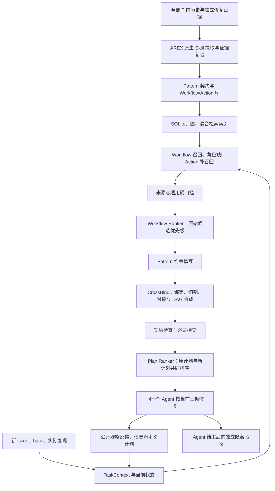

**Pattern 约束重写、CrossBind 与 Workflow Ranker：研发目标和模块设计**

日期：2026-10-03。目标项目 Pylint，相似项目 Pyflakes、Ruff。代码核查基线：`5ca171e69ba196f25b326123697ad5b48658dc0e`。本设计细化[时间切分实验 v2](pylint-temporal-swe-adaptive-skill-plan-v2-20261003.md)的 S3/S4；时间截点、全历史普查、SWE 任务并集、隐藏验收和静态知识库要求继续有效。[机器路线图](experiment-plans/pattern-crossbind-ranker-roadmap-v1.json)记录接口、验收和依赖。

本文保留 2026-10-03 的设计与验收要求。当前模块实现、历史监督及正式实验状态见[2026-10-04 状态审计](pattern-crossbind-ranker-status-20261004.md)：M0–M3 已有实现与契约测试，M4–M6 尚未通过完整验收，正式 SWE 运行数为 0。下文设计不代表所有实验已完成；开发校准后、正式题运行前统一冻结。

**1. 完善后的目标**

将历史经验提取为有证据支持的条件、机制、不变量和动作；在新 issue 的当前代码上，按 Pattern 约束重组、跨历史 Workflow 绑定和组合这些动作；使用可拒绝的效用 Ranker 选择可执行候选，并在独立验收下检验其修复收益、回归损害和成本。

| 用户建议 | 判断 | 实现时补足的条件 |
| --- | --- | --- |
| 从 Pattern 重组 Action，重写 Workflow | 合理，能够解除历史文件和步骤位置的束缚 | Pattern 表达语义角色、需要达到的效果、前提与不变量；当前 Workflow 是带条件的动作 DAG |
| CrossBind 截断、拼接 Workflow | 合理，能够补全单一历史案例缺少的能力 | 在语义状态边界切割，检查输入输出、版本、责任边界、读写冲突和验证闭包；语义未知须先探查 |
| top-k Workflow 后训练 LLM Ranker | 合理，能够改善相似度排序 | 检索覆盖仍是上限；Ranker 按当前适用性和预期修复效用排序，允许拒绝，训练来自时间隔离的历史监督 |

历史 Workflow 保持版本化、不可变。重写另产出 Workflow Template 或临时 Task Workflow，保留每个动作的原始来源及保留/删除/替换理由。暂时成功的 task plan 不自动成为新 Skill，也不在正式评测中回写知识库。若完整历史里没有足够独立的 Pattern 支持，系统仍可对单个 Workflow 做当前绑定，不能为了启用模块编造 Pattern。

**2. 现有实现和实际缺口**

| 实现 | 已有能力 | 本设计需要新增 |
| --- | --- | --- |
| [direct_skill_extraction.py](../src/arex_skill_graph/direct_skill_extraction.py) | 模型直接作者原生包；解析 Action 的前提、不变量、后置条件和验证；文件校验后派生索引 | 多来源 Pattern 包、动作端口/效果、历史序列与模板/当前计划分离 |
| [mining/pattern.py](../src/arex_skill_graph/mining/pattern.py) | 按预设 DEFAULT_PATTERN_SPECS、审核 domain 与角色映射生成候选；要求跨仓库支持 | 全历史驱动的机制归纳，独立来源计数和经验证的角色/条件；预设族只用于开发 fixture |
| [llm_governance.py](../src/arex_skill_graph/llm_governance.py) | 从多 Workflow 抽象 Pattern 的接口；当前适用 judge 选择一个候选或 null | 跨 episode/corpus 的原生包输出连接；多候选 Ranker、分项依据与 probe/reject/abstain |
| [schema.py](../src/arex_skill_graph/schema.py) | Pattern、Action、Predicate、Validation、Binding 等节点和 typed relations | 所需状态、作用域、效果和绑定契约；Task DAG 独立于历史图 |
| [multilevel_validation.py](../src/arex_skill_graph/multilevel_validation.py) | 引用、来源多样性、关系端点、DAG 检查；Binding 检查目标与证据引用存在 | 当前 base 对象存在、接口和语义状态可对接、未知项处理及组合后验证 |
| [retrieval.py](../src/arex_skill_graph/retrieval.py) | BM25/向量融合、图扩展和包准入 | Workflow 同级候选、Pattern 约束和缺口 Action 补召回；当前机制证据排序 |
| [store.py](../src/arex_skill_graph/store.py)、[text.py](../src/arex_skill_graph/text.py) | SQLite、FTS5、hash-v1 向量、可选 HNSW | 真正代码/文本 embedding 的建库与 query 编码共同升级、版本冻结 |
| [skill_packages.py](../src/arex_skill_graph/skill_packages.py) | 原生包身份/hash 校验；当前 hydrate 拼接 Actions 和历史 Workflow | 校验与渲染分开；Ranker 使用有出处的紧凑 capsule，solver 按需读取获准资源 |
| [run_cross_project_holdout_agent_eval.py](../experiments/run_cross_project_holdout_agent_eval.py) | 现有适用性判断和指导运行框架 | 新 SWE 路径移除 visible_test_patch；集成绑定/组合/排序及独立隐藏 evaluator |

当前检索的 type priority 会优先 Pattern，再 Workflow、Atomic。新路径应分通道召回并分别判断，不能因为节点抽象层级高就自动认为更适合当前任务。当前 Binding 节点也不等于已经实现 CrossBind。

**3. 总体结构**



选择器首先按来源/包完整性等门槛排除无效候选。语义判定由有证据上下文的模型和实际 probe 支持，确定性逻辑检查结构与可机器核实的事实；不能把关键词、类型名称相同或 confidence 数字当作语义证明。

初期限定一个活跃 Pattern、最多两个父 Workflow、有限候选和有限 probe。跨 Pattern 组合留待单 Pattern CrossBind 有证据有效后扩展。Ranker 在原始 Workflow 和最终 Task Plan 两处使用同一个服务边界，但使用明确不同的 candidate_kind 和监督目标。

**4. 数据契约与存储边界**

| 对象 | 关键字段 | 持久化角色 |
| --- | --- | --- |
| HistoricalWorkflow | workflow_id、package hash、source episodes、as-of 时间、历史 Actions/依赖/测试状态 | 不可变原始经验与 provenance |
| PatternContract | mechanism、applicability/exclusions、semantic roles、required effects、invariants、partial-order constraints、alternatives、support sets | 原生 Pattern 包内的可检验约束；历史例子位于 references |
| ActionContract | intent、inputs/outputs、preconditions、effects、preserves、read/write sets、binding requirements、oracle、source resource/hash | 原生 Action 卡片与派生检索视图 |
| TaskContext | public problem、base SHA、环境、MRE、诊断、当前 code anchors、责任边界、observed state、unknown facts | 本次运行信息；不含 gold/hidden test 信息 |
| BindingMap | role/port 到当前对象和接口的映射、证据、适配方式、PASS/FAIL/UNKNOWN | 只归属于当前任务 |
| TaskWorkflowPlan | 父来源、Pattern ref、bound action DAG、保留/删除/替换、约束检查、当前 oracle、预算和停止条件 | 临时计划；不是自动发布的新 Skill |
| RankDecision | 候选顺序、use/probe_only/reject/abstain、分项依据、未满足条件、预期效用与不确定性、模型/prompt版本 | 可审计选择记录 |

每个契约字段必须能追溯到作者文件、历史证据或当前观察。契约可在原生 Markdown 的结构化块中作者，再解析成 typed index；额外 JSON 只作投影/运行记录，不能代替 SKILL.md。机器可验证谓词必须有 evaluator；自然语言语义约束标为待判定/待 probe，不能假装符号执行已经证明。

现有 v3 直接包要求一个 source Episode、单个 Workflow 身份，并要求历史 Workflow 覆盖所有包内 Action。新增 v4 schema 应显式支持 package_kind、多个独立 source episodes、Pattern 契约和多种 historical realization；保留旧解析器，通过版本分派读取。历史包覆盖检查继续有效，当前 Task DAG 则允许省略不适用的动作。不能全局放宽旧校验以掩盖来源错误。

Pattern 包仍自包含，可收录必要的来源 Action 卡片和历史 realization，保留原 Workflow/资源 hash 和验证结果；引用资源不能依赖未受控外部文件。包结构、时间与 hash 通过不代表功能验证通过，两种状态分别存储。

**5. PatternContract 与 WorkflowRewriter**

Pattern 归纳需从多个有独立修复证据的历史 Workflow 出发，比较相同机制、职责、效果和失效边界。复用 issue 别名、复制测试或同一修复 PR 不能增加独立支持。跨项目 Pattern 至少有两个独立 bug cluster、两个项目的机制支持；只有自身多个问题支持时可发布 local template，不声称跨项目 Pattern。

Pattern 约束表达的是“必须建立何种事实、改变何种状态、保留何种行为”，而非一组统一的 analyze/implement/test 文本步骤。每个角色保存可替换的实现集合，以及何时使用、何时拒绝。历史位置和历史 PRECEDES 边仅是例子；必须顺序只来自当前数据/语义依赖。

WorkflowRewriter 流程：

1. 对齐 TaskContext 的目标、入口状态、责任边界和 Pattern 的条件，排除反例。
2. 将候选 Action 映射到 Pattern 角色；不清楚的映射成为 probe obligation。
3. 区分已满足效果、缺少效果、额外无关效果。只有有当前证据的已满足项才可省略相应动作。
4. 选择实现每个必要效果的动作，允许替代与可选分支；没有合格动作时输出缺口，不能虚构 Action。
5. 根据端口、前提/效果、读写关系和当前不变量构造偏序 DAG，保留变更、验证及异常路径的真实依赖。
6. 输出一个或少量模板/任务计划，记录每项保留、删除、重排、替换的证据与来源。

重写优化目标是当前目标覆盖、可绑定性、回归保持及成本，不是改变历史文本的比例。没有明确收益的原始 Workflow 可成为保留候选；原顺序与当前依赖一致时无需改变。

拟议接口：

```python
compile_pattern_contract(source_packages, temporal_policy) -> PatternContract
rewrite_workflow(pattern, task_context, action_pool, budget) -> RewriteResult
# RewriteResult: candidate_dags, unmet_effects, probe_obligations, rejection_reasons
```

**6. CrossBind：绑定、语义切割和受约束组合**

CrossBind 的输入是当前 TaskContext、Pattern 约束、已选父 Workflow 和有限 Action 池。输出带 BindingMap 的新 Task DAG 及逐项验证报告，不输出从旧代码直接拼接的 patch。

Action 端口示意：

```text
input: binding_facts
semantic_role: name_binding
artifact_kind: BindingFacts
language: Python
scope: module
analysis_phase: static | runtime
required_state: resolved
current_owner_requirement: 当前负责该事实的分析入口
```

语义角色一致仍不足以对接，须检查分析阶段、作用域、状态含义、当前接口和 oracle。Ruff 的 Rust 数据结构不能绑定成 Pylint 的 Python 对象；能够迁移的是机制与操作语义，具体接口由当前源码证据确定。

| 子步骤 | 算法与产物 | 拒绝或探查条件 |
| --- | --- | --- |
| Bind | 当前文件/符号/API 的定位；role/port 到对象的 BindingMap | 对象不存在、旧路径/接口、责任边界或版本不符；未知则 probe |
| Cut | 按效果和依赖闭包选择切点，保存 boundary state；DAG 的 cut 是依赖边界，不只是列表下标 | 删掉了必要前提、清理/恢复动作或变更对应的验证 |
| Match | 对齐一侧已建立状态和另一侧所需状态，检查端口语义、作用域、阶段及不变量 | 表面类型相同但语义不同；未知条件未核实 |
| Bridge | 必要时使用库中有来源的转换/补前提 Action，并绑定当前接口 | 任意编造 adapter；新操作只有假设时仅作为 probe，不宣称历史验证 |
| Compose | 合并子图，重命名局部变量，处理别名/读写冲突和候选替代，建立当前依赖 | DAG 成环、效果互相撤销、并发/全局状态冲突 |
| Validate | 验证引用、端口/绑定、前提效果闭包、Pattern 必要效果、保留不变量与公开 oracle | 结构 PASS 不能替代行为验证；未知写操作前提不获准 |

对于抽象状态可比较的边界，组合规则可以写作 `established_effects ⊇ required_preconditions`；只有可机器判定的事实适用这个符号检查。涉及名称解析、控制流、推断等语义时仍需当前代码证据/实测，不能宣称自然语言约束被完整形式化证明。

操作集合包括 truncate、splice、substitute、insert prerequisite、drop satisfied action 和 reorder independent actions。首版采用有限 beam/枚举加剪枝：只保留满足硬门槛的候选，最多生成四个组合计划，不对 top-k 的所有切点进行无界笛卡尔积搜索。无合法组合时保留合格单 Workflow 或回退普通 Agent。

每个候选都记录切点、被删动作、替代动作、边界状态、Bridge 来源、当前绑定和验证义务。CrossBind 同时支持“同一 Workflow 内替换”与“两个 Workflow 间组合”；不能把语法一致视为组合成功。

拟议接口：

```python
bind_and_compose(task_context, pattern, workflows, action_pool, budget) -> CrossBindResult
validate_task_plan(plan, task_context, resource_policy) -> PlanValidationReport
# 每项检查 status: PASS | FAIL | UNKNOWN，均附 evidence_refs
# probe_only 计划仅授权验证未知前提，不能直接渲染为已获准修改指令
```

**7. 检索与两阶段 Ranker**

沿用 SQLite/图与混合检索，但新增 candidate capsule：保留目标、机制、条件/反例、Action 能力、支持/验证状态、资源 hash 和短证据引用；不向 Ranker 无限制拼入全部历史 diff 和 Workflow。

第一层召回 Workflow 同级候选，独立获取 Pattern 契约；对 Pattern 的未覆盖角色做受限 Action/Atomic 补召回。仅取 top-k 完整 Workflow 可能遗漏分散于不同案例的互补动作，故须记录 role gap 和候选池覆盖。父 Pattern 批准不自动批准其邻居 Action。

第一处 Ranker 对原始 Workflow 判断机制匹配和当前使用价值，用于选择待绑定/组合的有限候选。第二处 Ranker 对已绑定原计划、单 Workflow 重写和 CrossBind 新计划共同排序，判断修复预期效用；只排序原 Workflow 无法评估后来生成的组合质量。两个入口明确 candidate_kind，可共享基座/服务，也可在训练时采用不同输出头。

| 排序维度 | 当前可观察依据 | 处理方式 |
| --- | --- | --- |
| 机制和目标匹配 | 诊断、MRE、状态变化、目标效果 | 分项依据引用当前观察 |
| 责任边界 | 当前状态/判断的实际 owner | 依据当前源码，不依赖相似文件名 |
| 前提/反例 | 版本、scope、配置、分析阶段、排除条件 | 已知违反拒绝；未知先探查 |
| 可绑定性/组合可行性 | BindingMap、端口、冲突/依赖检查 | 硬失败不能被其他高分抵消 |
| 验证充分性 | 公开 MRE、现有测试、邻近正常行为 | 不读取 hidden test_patch 或 gold-derived 路径 |
| 历史可靠性 | 独立修复支持、实际测试状态、边界覆盖 | 原始 issue 数/LLM 自信不能代替质量 |
| 成本和组合风险 | 预计 probe/动作/模型开销、未知连接及回归范围 | 记录预测和实际成本，开发集校准 |

Ranker 只排序通过准入的候选。来源时间、包完整性/状态、已知反例、成环、失效接口等门槛在模型外执行；语义门槛来源于有证据的判定，不能用确定性关键词规则替代。Ranker 可输出 null/abstain 和 probe_only，不能被要求总选第一名。

最终目标可表述为“预期验证修复收益 − 回归损害 − 资源成本”，具体损害/成本权重和接受阈值只在历史开发集确定。不要直接手设几项 LLM 评分加权便声称训练出了效用模型。对未知候选输出不确定性，confidence 仅是待校准预测。

拟议接口：

```python
rank_workflows(task_context, capsules, policy) -> RankDecision
rank_plans(task_context, validated_plans, policy) -> RankDecision
# ranked_ids, use/probe_only/reject/abstain, criteria_evidence,
# unmet_preconditions, predicted_utility, uncertainty, model/prompt versions
```

**8. LLM Ranker 的训练数据与监督**

先用相同 rubric 的 prompted LLM Ranker 作为可运行基线，再采集历史监督训练 Ranker。这样能先检查约束/组合是否有效，避免在不稳定动作表示和错误标签上进行昂贵训练。训练方式按运行条件选择开放模型的 adapter/LoRA 加排序头，或支持训练的模型接口；方案不假定现有 HTTP provider 提供微调能力，也不指定未核实的模型版本。

时间与身份隔离：

1. 从 T 前的历史已解决 issue 建立 query，只用修复前可获得的问题输入和 base。
2. 每个 query 的候选库按其任务输入时间 `t_q` 重建：候选正文、证据、修复和抽取来源均须早于 `t_q`。仅排除当前 issue 而保留后来修复的候选仍会泄漏。
3. 排除该 query 自身、同一修复 PR、别名/独立 bug cluster 和复制来源支持，不能让 Ranker 学习识别自己答案的指纹。
4. 训练、开发按时间及 bug cluster 分割；开发库固定在训练结束截点，开发答案不参与模型训练。实体/来源去重覆盖 donor 别名和跨仓库镜像。
5. 正式 T 后 SWE 题、已暴露开发题列表和最终隐藏结果不参与 Ranker 训练、阈值选择或超参数校准。

第一层监督：由有证据审阅给出 unrelated、probe_only、adaptively_usable 等分级标签及简短依据。LLM 可辅助提案，人工/独立证据核查验证；人工标签和模型自评分别记录。仅用 LLM 自生成 preferred/rejected 样本不能证明真实修复效用。

第二层监督：在隔离的历史任务上，让固定 solver 分别使用有限候选、组合候选和无指导基线，按相同预算运行，独立测试得到修复、回归、成本与失败原因。gold/test_patch 只供历史标签 evaluator 使用，不进入 Ranker、planner 或 solver 的输入。记录不同随机尝试的不确定性，不能把一次成功当作精确成功概率。

构建同 query 内的 pairwise/listwise 数据，优先使用有验证结果的差异。候选包括正确机制但错误前提、正确效果但旧接口、相似症状但相反诊断、缺验证或冲突组合等难负例。观察效果相当时保留 tie，不强行赋予赢家。候选采样预定且覆盖不同排名，记录采样概率；不只执行现有 Ranker 的 top-1 再把其余候选标失败。

可采用 pairwise 排序损失 `-log sigmoid(s(q,c+) - s(q,c-))`，配合可适用性辅助监督；效用权重依据开发指标设置。训练后用时间后移/独立 cluster 的开发集校准拒绝与不确定性。Checkpoint 保存基座/adapter 版本、数据 snapshot/hash、split、prompt、目标/采样、阈值和成本；不保存凭据。

拟议数据记录：

```text
query_id, bug_cluster_id, input_available_at, base_commit, temporal_catalog_hash
candidate_kind, candidate_id, package_hashes, current_evidence_refs
graded_applicability, verified_outcome, regression_result, measured_cost
pair_preference_or_tie, label_source, evaluator_version, sampling_probability
```

Ranking 的 recall@k/nDCG 使用有依据的分级标签；结果监督的效用排序另报。Ranker 无法挽救没有被召回的动作，故召回失败、排序失败、绑定失败和修复失败分层统计。模型预训练接触公开问题的风险仍不可完全核实，与 v2 的基础模型暴露限制同样报告。

**9. 一个用于说明边界的 Pylint 示例**

以下是机制示例，不声称来自已核验的新 benchmark 题或已经跑通的组合。

新问题假设为 TYPE_CHECKING 相关诊断错误。一个历史 Workflow 提供“识别当前名字的类型专用上下文”动作，另一个提供“在真正负责诊断的入口缩小条件，并保留运行时检查”及验证动作。Pattern 要求区分静态用途与运行时可用性，保持块外真实 used-before-assignment 等行为。

Rewriter 可选当前上下文识别、owner 定位、窄条件修改与相邻验证，跳过旧项目专用插件初始化。CrossBind 将它们绑定到当前 Pylint 入口，并检查“上下文事实”确实满足诊断 guard 所需前提。如果前段仅产生静态 UsageFacts，而后段要求 RuntimeBindingFacts，则不能直接对接；应探查/选择有来源的替代，而非因为都包含 TYPE_CHECKING 就拼接。

若候选效果是“全局跳过 TYPE_CHECKING 块”，且会压制真实运行时诊断，保留行为约束应拒绝它，即使文本相似度或 Ranker 偏好很高。成功标准是当前诊断修复且相邻行为保留，不是 Workflow 文本变得不同。

**10. 文件与接口实现计划**

以下均为建议新增，当前尚不存在对应实现。

| 拟议模块 | 主要职责 | 依赖/对接 |
| --- | --- | --- |
| src/arex_skill_graph/action_contracts.py | ActionContract、端口/效果/谓词类型、来源一致性 | 原生 Action 卡片解析、schema/store |
| src/arex_skill_graph/pattern_contracts.py | 多来源归纳、角色/效果/条件、原生 v4 Pattern 包 | LLMGovernance、direct extraction、admission |
| src/arex_skill_graph/task_context.py | 当前观察和 base anchors、三态事实、禁用输入校验 | 修复 runner 的公开工具观察 |
| src/arex_skill_graph/workflow_rewriter.py | Pattern 约束下的动作选择与偏序 DAG | PatternContract、Action pool、TaskContext |
| src/arex_skill_graph/crossbind.py | Bind/Cut/Match/Bridge/Compose、限额候选生成 | Rewriter、当前对象定位和工具 probe |
| src/arex_skill_graph/plan_validation.py | 引用/状态/端口/依赖/冲突/验证闭包与 tri-state report | 复用 multilevel validator，新增 current binding 检查 |
| src/arex_skill_graph/workflow_ranker.py | Workflow/Plan 两个入口、准入、拒绝与模型版本记录 | 复用 LLMTransport；有训练模型时接模型 scorer |
| src/arex_skill_graph/guidance_renderer.py | 校验与按需资源渲染分开，统一 token/来源/根包计量 | hydrate 校验、获准 Task Plan |
| experiments/build_temporal_workflow_ranker_dataset.py | 历史 query 快照、去重、候选与标签/配对记录 | 时间目录、历史 evaluator、固定 solver |
| experiments/train_workflow_ranker.py | 数据/模型版本、排序训练和开发校准 | 可配置训练后端，不假定 provider 支持微调 |
| experiments/eval_pattern_crossbind_ranker.py | 模块消融、共享候选实验、绑定和成本分析 | v2 runner/paired evaluation/hidden evaluator |

已有代码更新点：direct extraction/skill_packages 进行显式 v4 版本分派；mining/pattern 保留预设 builder 作开发对照；retrieval 增加同级候选与 role gap 补召回，禁用无条件层级优先；store/text 统一外部 embedding 的生成与查询；llm_governance 的单选接口保留兼容，新的多候选 Ranker 独立接入；SWE runner 移除隐藏测试输入并统一成本。

**11. 规模、预算和失败处理**

继承 v2 的开发起始上限：累计 300,000 input+output token、全部模型调用 60、工具调用 120、30 分钟、历史内容累计 6,000 token，最多两个获准根包指导单元；这些仍未正式冻结。检索、Ranker 两处、重写、CrossBind、probe、资源读取与 solver 全部计入预算。

建议开发配置：retrieval seed 40，Workflow 候选最多 8，图扩展 1 跳，活跃 Pattern 最多 1，CrossBind 父 Workflow 最多 2、beam width 4、新组合最多 4、每轮补前提 probe 最多 2、总检索/复查最多 3 轮。最多两父 Workflow 是组合搜索限制，不是全历史学习范围。

所有读取的历史 capsule/Pattern/Action/reference 都计入 6,000 token。最多两个获准根包包括实际读取的独立 Pattern 包；一个自包含 Pattern 包可收录多个历史 realization 的必要资源。不能通过图邻居或 Bridge 偷读第三个包；需要更大包数时在开发阶段统一修改各组预算并重新冻结，不在正式运行中临时增加。候选摘要调用成本和被拒候选读取同样计量。

硬失败拒绝候选；语义未知只授权 probe；probe 失败或无相关候选回退普通 Agent。预算耗尽仍计失败，不额外赠送重试。停止和回退条件由当前观察触发，不要求执行全部历史动作。任务计划变更在本次 run 记录，主实验库/索引/Ranker checkpoint 保持只读。

**12. 实施顺序与验收**

| 阶段 | 交付 | 验收条件 |
| --- | --- | --- |
| M0 契约与输入隔离 | Action/Pattern/Task/Plan schemas、v4 native package adapter、审计格式 | 旧 v3 兼容；来源/hash/时间一致；隐藏数据拒绝；每种状态有明确语义 |
| M1 Pattern 重写 | 多来源角色/条件、单 Workflow rewrite 与当前绑定 | 多种 realization 支持；必要效果不丢失；反例拒绝；相同当前依赖允许保留原顺序 |
| M2 CrossBind | 边界状态、依赖 cut、端口/效果对接、冲突检查、有限组合 | 合法组合有当前对象和验证；未知连接不授权修改；成环/阶段不符/漏验证拒绝 |
| M3 prompted Ranker | 同级 Workflow 和 Task Plan 排序、拒绝与预算计量 | 不存在的 ID 拒绝；顺序扰动检查；低相似但机制正确候选不被类型优先淹没；空候选回退 |
| M4 历史监督训练 | 时间 query 库、expert/执行标签、训练 checkpoint 与开发校准 | 自身答案/未来候选/alias 泄漏检测；真实结果标签独立；tie 和采样记录完整 |
| M5 实验冻结 | 任务并集/全历史库、模块配置、模型/Ranker/prompt、预算/调度/分析 | v2 S1/S2 总体完成；开发 smoke 通过；正式题、隐藏答案和结果未用于训练/校准 |
| M6 正式与机制实验 | 配对修复结果、召回/排序/绑定/回归/成本报告 | 独立隐藏验收；所有无匹配/失败在分母；按独立 issue/bug cluster 统计 |

M0–M3 可使用已暴露种子或人工构造小 fixture 联调接口，但不能以此声称完成全历史学习或真实泛化。正式 M5/M6 仍依赖 v2 的完整时间普查和合格 benchmark 并集；M4 的训练库也必须满足逐 query 的时间约束。

关键验证至少覆盖：正确 cut/splice；缺前置状态；static/runtime 端口不符；历史文件不存在；跨语言接口未绑定；别名/写冲突；必要验证被截断；组合成环；假 Pattern/重复支持；v3 兼容；包/hash/来源时界；Ranker 返回非候选 ID、次序偏差、全部拒绝；无训练能力时 prompted 模式；预算/禁用资源输入。

**13. 如何证明三项模块带来收益**

保留 v2 的 B0–B4 主对照；另外预注册一组模块研究，配置与额外成本在正式执行前冻结，不能把原 300 条资源算例继续当作全部模块实验总量。

| 模块配置 | 主要差异 | 可回答的问题 |
| --- | --- | --- |
| E0 | 原始候选、当前绑定与适配，prompted Ranker | v2 计划中的适配基线 |
| E1 | E0＋Pattern 约束单 Workflow 重写；不跨 Workflow 组合 | Pattern 约束和重写是否改善当前解法 |
| E2 | E1＋CrossBind；仍用同一 prompted Ranker | 合法跨案例组合是否有增量 |
| E3 | E2＋历史监督训练 Ranker | 在相同生成器/预算下，训练排序是否有增量 |

端到端比较允许排序改变后续候选；要隔离 Ranker 本身，另做共享公开观察前缀、冻结同一候选池/计划池的 prompted vs trained 配对排序实验，分支后不共享 patch 或验收结果。要隔离 Pattern/组合质量，同样记录冻结池内可覆盖但被错选的候选。必要时做逐模块移除，避免只用递进组把交互贡献全部归给最后一个模块。

主指标仍是 ValidatedResolved@1 与各官方协议的 BenchmarkResolved@1；另报检索/角色覆盖、适用性拒绝准确性、nDCG、Task Plan 当前 grounding、合法组合/错误拼接、回归损害、无匹配率及离线训练/在线成本。候选和角色引用数、结构合法率、Workflow 重写比例和 Ranker 自报评分都不是最终效果。

泛化分层在看最终答案前依据公开输入/base 确定：时间间隔、近重复与机制迁移、当前 API/版本变化、自身/跨项目支持、单案例可覆盖与需互补动作、反例/不适用、库覆盖不足。历史开发还可做 donor/project 或机制簇留出；不同支持规模和成本单列，不能将更多来源的收益自动归因于更好的 Ranker。

下一步实施应从 M0 的契约和当前输入边界、M1 的单 Workflow 重写开始，然后做 M2 的小规模合法/非法组合校验。M3 先建立 prompted 排序基线；在候选表示、绑定与真实标签稳定后推进 M4 训练。这样可以逐项检验三点假设，并保持正式 SWE 实验的时间与答案隔离。
