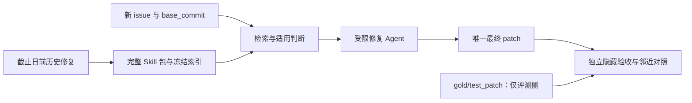

**Pylint 上的 AREX Skill 效果实验方案 v1**

日期：2026-10-03。这里的 SWE 指软件工程中的真实 issue 修复任务；首轮目标仓库为 Pylint，任务池来自 SWE-bench Live。方案依据[项目选型报告](first-project-for-issue-derived-skills-20261003.md)和[已审核来源与候选清单](data/first-project-issue-study-20261003/experiment-selection.json)。机器可读方案见[计划清单](experiment-plans/pylint-swe-skill-effectiveness-v1.json)。

建议先做 **5 组、最多 20 个合格任务、每组每题 3 次独立尝试的静态试验**，回答系统能否改善真实修复、相似项目是否提供增量。随后用控制单个因素的实验分析表示、图扩展和适用判断的贡献，再扩展到第二个项目。当前是执行前方案，尚未冻结最终合格题目、模型和预算，也没有新的修复结果。

**1. 要验证的结论及其范围**

| 问题 | 预先约定的比较 | 可以支持的结论 |
| --- | --- | --- |
| RQ1：完整系统是否改善修复？ | B4 自身＋相似 Skill vs B0 无历史指导 | 在同一 Agent 和预算下，完整系统的总效果 |
| RQ2：是否优于常规历史检索？ | B4 vs B1 原始历史 RAG | 完整 AREX 相对历史 RAG 的效果；其中包含表示、路由及检索差异 |
| RQ3：相似项目是否有增量？ | B4 vs B2 仅自身 Skill；另报告 B3 仅相似 Skill | 加入相似来源后的增量；来源数量不同的影响须另做匹配实验 |
| RQ4：哪些机制起作用？ | 相同证据的表示对照、关闭图扩展、关闭适用 judge | 分别分析 Skill 表示、图扩展和适用判断 |
| RQ5：是否降低成本或造成误改？ | 所有组的实际成本、诊断保留及不适用题结果 | 修复率、成本、错误激活之间的实际取舍 |

首轮结论限定在这个 Pylint 时间段、任务子集、模型与预算。Pylint 上成功不能直接表述为整个 SWE-bench、所有项目或所有模型有效。Skill 存在、包验证通过、检索命中以及 LLM 高置信度都不是修复成功的替代指标。

**2. 四种数据角色及严格边界**

| 数据角色 | 本轮已有材料 | 允许用途 | 禁止用途 |
| --- | --- | --- | --- |
| 历史知识来源 | 2024-01-01 前合并的 14 个种子：Pylint 4、Pyflakes 5、Ruff 5 | 复验历史修复；编写 Skill；构造训练期包 eval | 导入现时 timeline 的晚期引用或后续目标补丁 |
| 开发集 | 已审阅的 Pylint PR 9782、10034、10209、10275、10350 | 校准通用运行器、测试解析、预算和提示格式 | 计入最终盲评；作为历史 Skill 的修复证据；按其解法修改 Skill 正文 |
| 最终评测候选 | 已列出的 20 个未读取 gold diff 的任务元数据 | 仅按预定资格规则核验、分层、冻结 | 用 baseline/AREX 的修复表现决定保留谁 |
| 隐藏验收材料 | 目标 gold patch、test_patch、FAIL_TO_PASS、PASS_TO_PASS、补充对照 | 独立评测进程资格检查和最终打分 | 被提取器、检索器、修复 Agent 或其可读目录访问 |

历史来源截止日为 **2024-01-01，exclusive**。必须同时检查 PR 合并时间、原始 issue 创建/关闭时间、正文 lastEditedAt 和固定实现提交。较晚的修复即使解决较早的 issue，也不能进入历史库。已保存的现时项目文档用于选型；Agent 获得的是目标 base_commit 对应的文档和配置。

14 个种子目前是经过实现/测试差异审阅的来源，仍需历史提交上的因果复验。13 个 PR 修改了原仓库测试，不等于这些测试已经全部执行通过。Pyflakes #750 的发布版本对照已经通过，但尚未隔离该 PR；完成单提交复验前不把它当作强功能证据。

开发集可用于调整通用执行预算、序列化和工具使用说明。训练 Skill 的领域动作、边界和证据必须追溯至截止日前来源；开发 gold 的语义发现不得写入这些包。通用 prompt 的每次修改均记录版本和修改依据。

**3. 固定任务池，先资格检查，再做 Agent 实验**

固定数据集为 `SWE-bench-Live/SWE-bench-Live`，revision：`b51a86422e10cfd403beb4773e5a2947953e36ec`；配置 default、split verified。原始 parquet SHA-256：`080e36e46198bf9c177a6b077624d4028baf6ff04d661c332cc1fe1e5dfa50b2`。这是 Live 的 verified split，与独立发布的 SWE-bench Verified 数据集分别标注。

20 个候选的 PR 编号为：`9771, 9772, 9785, 9844, 9866, 9868, 9876, 9882, 9917, 10036, 10062, 10097, 10170, 10225, 10228, 10232, 10240, 10246, 10300, 10328`。编号代表修复 PR；原始 issue 编号、日期及 base_commit 保存在来源清单，不能混用两者。

每题资格检查依次完成以下步骤，所有决定发生在任一组正式解决该题之前：

1. 核对冻结数据集的 instance_id、base_commit、原始 issue 日期和任务输入。恢复修复出现前的正文；排除后补答案、修复建议和不可核实的正文修改。`hints_text` 默认不提供。无法验证输入时间边界的任务记录为未合格，不宣称其是严格时间盲测。
2. 在隔离环境中配置该题的 Python、Pylint、Astroid 和依赖，记录锁定版本、镜像 digest、测试解析器和 harness 提交。Python 3.12.3 上的旧版小复现不能替代每个历史环境的资格检查。
3. 使用同一环境、同一固定 test_patch 验证：base_commit 的目标测试确实失败，gold patch 应用后确实通过；PASS_TO_PASS 在 base 和 gold 上均按协议通过。确认测试被收集和执行；跳过、零测试和测试环境报错不能视为目标失败。
4. 根据 issue、语言语义和 base 代码预先设计至少两个邻近对照，包含应保留的正确行为；冻结测试后由评测侧检查 base/gold。对照的预期应清楚，不能以“让 gold 通过”为目标反复改断言。对诊断任务优先包含一个应报错和一个不应报错输入。
5. 检查跨项目复制测试、同一 MRE、同一跨仓库 bug、移植修复和系列 PR。高度重复的评测题按独立 bug cluster 处理；不把这种重复当作多个独立成功。语言机制相似本身是研究对象，不据此删除所有相似题。
6. 仅用 issue 和 base 代码标记适用族、是否需要额外版本环境及标签不确定性；不用 gold diff 标记“这道题应该使用哪个 Skill”。冻结最终 manifest、排除日志和 hash。

资格检查由隔离的评测进程读取 gold；设计者和 Agent 不读取剩余候选的修复实现。若必须人工读取某个 gold 来排查歧义，该题立即转入开发集，退出盲评。

最终题数记为 N，**N≤20**；所有合格题均进入全体结果，适用题和不适用题另分组报告。不要为了获得整齐的 20 题补入已看过修复的案例。若 N<12，或三个主要 Skill 族只有极少任务，先报告资格与覆盖不足；新增任务只按预先相同的规则建立独立的新 cohort，并在看到其 Agent 结果前冻结。

**4. 历史来源复验与真正 Skill 提取**

每个历史 episode 保存：原始 issue/MRE、修复前提交、固定修复提交、实现与测试差异、环境、前后测试结果、证据限制。执行 base-fail/fix-pass 和邻近行为检查；确因环境无法复验的来源标记弱证据，不能伪造 functional eval 为 passed。

第一批以 14 个种子为起点，预计组织成 3—5 个有边界的族，实际包数由语义独立的 Workflow 决定，不要求每个 issue 恰好一个包：

| 优先族 | 动作与不变量 | 必须保留的边界 |
| --- | --- | --- |
| 名称绑定与作用域 | 分辨 target/读取节点、所属 scope、推导式与 PEP572 绑定；沿分析入口修改条件 | 同一名字不等于同一绑定；祖先为 NamedExpr 不等于当前节点为其 target |
| 注解角色与检查时机 | 分辨类型/值/Literal、仅注解/带赋值、延迟检查与实际求值顺序 | `x: int = x`仍须检查值表达式；不能对所有注解免检 |
| 类型提供方与运行路径 | 解析 typing/typing_extensions 及别名；区分类型用途与块外运行时使用 | TYPE_CHECKING 内导入与运行时先使用后赋值的诊断方向不同 |

如果初始库对预定义问题族的历史支持不足，只能在正式任务运行前按截止日和统一检索规则扩充来源，建议目标总量 30—45 个独立修复、每仓库约 10—15 个。该数字是来源建设目标，当前未采集或验证。扩充数量、未提取成功的 episode、defer 原因和覆盖变化全部报告，不能只展示抽取成功的例子。

沿用当前的直接文件流程：历史证据 → 模型直接编写包 → 文件/引用/证据校验 → graph/SQLite/HNSW。历史 candidate JSON 是兼容 IR，不作为这轮的最终 Skill。包包含：

```text
<skill-name>/
  SKILL.md
  references/actions/*.md
  references/evidence/*.md
  references/workflow.md
  references/provenance.json
  evals/activation-cases.json
  evals/applicability-cases.json
  evals/functional-cases.json
  scripts/verify_package.py
```

所有组使用相同的提取模型、prompt、预算和审核规则。每源先提取一次；仅允许最多两次有记录的包协议/引用修复，仍只提供同一历史证据。语义证据不足则 defer，不反复抽取直到得到漂亮的 Skill。

分别建立自身、相似、混合三套只读 catalog，准入时检查完整 provenance；混合来源 Pattern 不能因为 repository 字段为空而漏进仅自身组。Atomic 是动作 reference，主要服务单位是完整 Workflow 包。

Pattern 只有在至少两个独立项目的 Workflow 支持同一机制、证据可执行、适用与不适用条件清楚、语义审核通过时才成为候选服务包。结构审计 Pattern、deferred/rejected Pattern 均不可注入。没有合格 Pattern 时可以先验证 Workflow 系统；要如实记录服务的层级，不能宣称已经证明 Pattern 有用。

冻结包、catalog、embedding 模型、HNSW 构建参数与所有 hash。正式静态实验期间不合并、不修订、不晋升 Skill，也不把某题的修复反馈用于下一道题。

**5. 先检查 Skill 本身，再评价修复能力**

各族在训练来源或开发前构造独立于最终题目的 activation/applicability 用例；建议每族各含至少 5 个正例和 5 个负例。functional 用例使用历史修复的可执行行为和边界测试。变形输入的预期必须有语言语义或项目测试支持。

| 层次 | 检查与指标 | 能说明什么 |
| --- | --- | --- |
| 包结构 | frontmatter、引用闭环、provenance、独立 verifier、hash、实际 context hydration | 产物可交付与可加载 |
| 激活 | 触发 precision/recall，弱相似负例上的误触发 | description 是否有可判断的信号 |
| 适用 | 已触发条件下的 precision/recall、拒绝原因与不确定标签 | 是否识别适用边界 |
| 行为 | 历史 MRE 与正反例的实际测试结果 | 动作所依赖的历史知识是否成立 |
| 真实修复 | 后续 issue 的隐藏测试结果 | 是否能帮助 Agent 修复新问题 |

预期标签先于模型结果冻结。不能使用 judge 自己的置信度作为正确性标签；不确定案例单独报告。包 eval 的通过不能计入 SWE 修复成功率。

**6. 主实验的五组**

| 组 | Agent 获得的历史指导 | 来源 | 主要用途 |
| --- | --- | --- | --- |
| B0 | 无额外历史指导 | 无 | 同一 Agent 的能力基线 |
| B1 | 原始历史证据 RAG：issue/MRE、固定旧修复、测试证据和限制 | 自身＋相似，与 B4 相同来源白名单 | 强历史检索基线 |
| B2 | 仅自身来源的已验证 Workflow/合格 Pattern | Pylint | 本项目经验 |
| B3 | 仅相似来源的已验证 Workflow/合格 Pattern | Pyflakes＋Ruff | 跨项目经验 |
| B4 | 完整 AREX：已验证包、检索、图扩展、适用判断、context hydration | Pylint＋Pyflakes＋Ruff | 完整系统 |

B1 使用冻结的 BM25＋dense 检索及固定 reranker，提供可读证据，避免把它实现成质量差的 JSON dump。B2/B3/B4 使用相同检索与适用算法，仅准入来源不同。所有组都能读相同 base 仓库和运行相同公开测试。

B4 vs B1 是系统相对 RAG 的对比，不能单凭它归因于 SKILL.md 格式。B4 vs B2 包含增加来源数量和混合 Pattern 的作用；证明“相似项目比同数量自身历史更有价值”还需要第 11 节的来源数量匹配。

每个 task×replicate 是一个随机顺序的完整五组 block。3 次尝试都从干净 base 开始，轨迹和可控的本地状态隔离；没有前一组 patch、对话或反馈。供应方 prompt cache 若无法隔离，统一缓存策略、记录 cached input 并随机化顺序，不能把不同命中率直接解释为算法加速。复现调度使用固定随机种子，模型 seed 仅在供应方支持时记录；不把 replicate_id 冒称为可控模型 seed。

**7. 模型、预算与上下文公平性**

修复模型的供应方、确切 model ID/可用 revision、推理档位、温度、上下文压缩策略、工具权限和 CLI 版本全部固定。当前计划不指定未经验证的模型别名；在开发集一次校准后写入正式冻结配置。

建议开发校准的起始上限如下；它们是计划值，正式运行前可以根据开发集调整一次并冻结：

| 项目 | 起始上限/规则 |
| --- | --- |
| 每次最终修复尝试累计 LLM token | 300,000；包含检索 query/reranker/applicability 的 LLM 消耗及修复 Agent，统一使用供应方 usage 口径 |
| 历史信息 context | 最多 6,000 token；包含 Skill、Workflow、Actions、evidence 和额外读取历史材料 |
| 注入包 | 至多 2 个完整可执行指导单元；不得裁掉适用条件或必需 Action 以满足上限 |
| 初始检索 | seed_k=40，候选 top_k=8；图扩展 1 hop，均在开发后冻结 |
| 修复交互 | 最多 60 个修复模型调用、120 个修复工具调用；历史材料读取也计入工具及指导额度 |
| 单次墙钟时间 | 30 分钟，含指导构建与修复；预安装与独立最终评测另报 |
| 并发 | 首轮默认 1 个修复运行；增加并发时各组使用相同配置，不能把负载差异当加速 |

历史 context 相同上限不代表信息量严格相同；严格表示归因用第 11 节的相同证据实验。B0 也获得相同总计算上限，其空历史额度不填充无意义文本。B2/B3 没找到适用 Skill 时自然回退，空检索题仍保留在该组分母。

历史读取通过限额的 context loader/资源工具提供，不能把整个 Skill 库或原始语料挂在 Agent 可任意读取的路径上。必需 Workflow 和 Actions 在预算内完整加载，evidence 按冻结策略加载；超额则舍弃较低排名包或不注入。所有后续读取计入同一额度，日志保存实际文件与 context hash。

累计 token 是多次调用的 input+output，缓存 input 仍单列并按统一规则计量；reasoning 是否已包含在 output 按供应方 usage schema 归一，不能重复相加。若供应方不提供某项，明确记 missing/estimated。费用用当时实际计费口径报告，不把 token 数直接冒充费用。

执行器在调用前预留输出额度，在调用后更新余额；不能仅在跑完后发现超预算。上下文压缩不能偷偷清除技能的不适用条件；压缩策略各组相同，事件被记录。超时、token/调用额度耗尽均作为一次尝试失败，不额外赠送修复轮数。

**8. 独立评测与防泄漏**



Agent workspace 只含目标 base 快照、公开文档、原本已有测试及它自己添加的 MRE/测试；不含 gold patch、隐藏 test_patch、未来 git 对象、完整分析仓库、其他组产物或历史模型记忆。访问网络不能取得目标 PR/commit/讨论的答案；模型调用通过运行器进行，项目构建依赖预安装。

目标仓库的通用 agent 配置在各组保持一致，额外全局 Skill 自动加载关闭，避免 B0 也读到本实验知识。每组历史语料使用对应独立白名单；检索、图扩展、judge 输入及 hydration 均检查来源，不能只在最后 prompt 做过滤。

Agent 可以运行 base 公开测试并增加自己的验证。既有断言不能被删除或弱化；禁止全局关闭目标检查、无条件忽略异常或修改评测器来让测试变绿。新增测试不是最终打分 oracle。候选 patch 的应用与冲突处理策略必须与冻结 harness 一致并在开发阶段验证。

最终 patch 提交后，终止 Agent，再在独立干净 evaluator 快照中应用候选实现、冻结验收材料和邻近对照。验收输出不返回 Agent，不允许“再修一次隐藏测试”。评分不用与 gold 的文本相似度，也不要求恰好修改维护者修改的文件。

保存脱敏后的 prompt、实际读取材料、context hash、LLM/tool trace、最终 patch、测试收集数量、诊断结果和环境 hash。凭据仅由已配置客户端在运行时使用，不写进命令记录、prompt、manifest 或 Git。

时间切割控制的是本系统历史库和运行器的泄漏，不能保证基础模型的训练数据没有见过公开 issue 或补丁。记录模型与任务时间，在结果中明确这一限制；后续增加较新的独立 cohort 或前瞻任务。各组共享基础模型有助于比较增量，但不能据此声称所有题对模型完全未见。

**9. 成功指标、成本和错误分解**

主指标为 **ValidatedResolved@1**：冻结 benchmark 验收通过，邻近行为/回归检查通过，且无泄漏与测试篡改。每次轨迹只输出一个最终 patch。并列报告 **BenchmarkResolved@1**，即冻结 benchmark harness 自身的 resolved 判定，保留与公开协议的可比性；两个数字不能混写。

| 指标 | 定义或口径 |
| --- | --- |
| 主修复率 | N 个合格题×R 次尝试上 ValidatedResolved 的平均；每题等权 |
| benchmark 修复率 | 相同候选 patch 在冻结官方协议下的 resolved，不用 LLM 总分替代 |
| 配对增益/损害 | B4 成功而对照失败、对照成功而 B4 失败、双方成功、双方失败；逐题展示 |
| 诊断保留 | 邻近“应报/不应报”输入及既有 P2P 的通过数量/总数，分别报告 |
| 检索与适用 | 候选覆盖、实际被加载包、错误激活、正确拒绝、不确定标签及其分母 |
| 修改质量 | 无关文件/配置改动、现有断言弱化、跳过规则等；盲化审阅补充测试结果 |
| 在线成本 | 指导构建＋修复的 input/output/cached/reasoning、工具调用、时间及实际费用 |
| 离线成本 | 来源采集、历史复验、提取、语义审核、embedding/index 构建；单列总量 |
| 实验总成本 | 所有开发、失败提取、重跑和重复尝试的实际消耗，不能只报成功轨迹 |

若一个方案更快但修复更少，直接报告两者，不给加权总分把失败补偿成胜利。既有 60/25/15 评分和“两分获胜”阈值可以作为工程辅助，不作为本研究的主终点、统计检验或 promotion 依据。

失败首先按客观记录区分基础设施故障、正常预算耗尽、patch 应用失败和验收失败。对验收失败再做盲化分析：未召回、错误适用、组合错误、动作执行错误、陈旧接口适配或缺少验证。Agent 声称使用了某个 Action 只表示自报告；“真正执行了动作”要有读取/工具/修改证据支持。

效率先报告全部尝试的成本及“总成本/正确修复数”。双方都成功的题可另做时间配对分析，但标为条件描述，不能用它代替全体效率结果。Offline_cost + M×Online_cost 的摊销曲线可以帮助决定实际复用多少题后划算；只有成本差为正且正确率满足事先约定时才计算盈亏平衡点。

**10. 样本规模、重复与统计**

建议每个合格题各组 R=3 次独立尝试。N=20 时主实验是 **20×5×3=300 次修复轨迹**；开发 5×5×1=25 次，合计 325 次，来源提取和独立评测另外计量。预算上限为理论 cap，不是运行时间或账单预测。

先完整完成所有题的 replicate 1（最多 100 次）以检查执行稳定性，随后按预定计划完成 replicate 2/3。第一遍结果不能用于删除难题、换模型、调 Skill 或改变组别；技术或预算原因中止时报告实际完成的预定 block。

令 y(i,a,r) 为题 i、组 a、第 r 次是否成功。每题对比使用 `d_i = mean_r y(i,B4,r) - mean_r y(i,control,r)`，总体差为这些 d_i 的平均，单位是百分点。**重复尝试不是新增独立题，300 条轨迹不是 300 个独立样本。**

预注册 B4−B0、B4−B1、B4−B2 三项对比，报告逐题结果、任务/独立 bug cluster 级配对 bootstrap 95% 区间，配对置换检验的 p 值，以及三项检验的 Holm 校正。样本小或 cluster 过少时标记探索性，不用缺乏显著性证明无效果。固定 bootstrap/permutation 随机种子及次数。

例如 20 题单次尝试中只有 5 题由失败变成功、没有反向损害，增益为 25 个百分点，但单次双侧 exact McNemar p=0.0625。这说明“肉眼有明显提升”仍可能没有足够统计证据；三次尝试可以观察稳定性，不能把它变成 60 个独立 issue。

主试验默认是机制与方向试验。正式论文结论在开发/这轮试验之外增加独立任务 cohort，并按已观察的配对分歧、目标可检测差值和实际独立 cluster 数做样本量规划；“扩到 50—100 题”是资源目标，不是保证 power 的公式。

不适用题的误改风险与覆盖题结果都报告。若全体 baseline 接近全解，报告成本和损害，并以预先同样规则建立更复杂的新 cohort；不能筛选出本轮 baseline 失败题再冒称全体性能。

**11. 机制实验：一次只改一个因素**

| 额外条件 | 固定什么，改什么 | 可以回答什么 |
| --- | --- | --- |
| A1 相同证据 raw vs Skill | 在解决前冻结 B4 检索/适用产生的 source episode ID 集合；两条件的独立轨迹分别看这些来源的原始证据或 Skill，相同指导上限 | 在相同检索证据条件下的组织方式贡献 |
| A2 无图扩展 | 来源、包、embedding、候选与 judge 策略相同，expand_hops 从 1 改 0 | 图扩展的增量；仍可能直接检索到 Pattern |
| A3 无 LLM 适用 judge | 保留包完整性、provenance、状态及 deferred/rejected 等硬门槛；关闭语义适用筛选 | 适用判断能否减少错误激活/误改 |
| A4 仅 Workflow | 同一来源和预算，禁用服务 Pattern，保留 Workflow/Action | 合格 Pattern 的贡献；有实际 Pattern 才运行 |
| A5 自身来源数量匹配 | 另建截止日前、相近问题族的纯 Pylint 库，匹配独立 episode 数、提取预算和 context 上限 | 相似来源是否比“多给一些自身历史”更有价值 |
| A6/A7 donor 消融 | 各移除 Ruff 或 Pyflakes，其他条件固定 | 来源贡献及传承/复制关系的影响 |

A1 的 raw 视图必须包含 Skill 所有 provenance 对应的来源，不能让 Skill 暗藏 raw 组没得到的新 episode。选材与预算截取在任何解题结果出现前完成；若无法匹配同一证据集合，记录不可匹配并不进行纯表示归因。该条件中的 raw 获得与 B4 相同的选择结果，因此不用于声称普通 RAG 的实际检索能力。

主五组之外再加 A1/A2/A3，N=20、R=3 时总计 **480 次正式轨迹**，开发量另计。优先次序为相同证据表示 → 适用 judge → 图扩展。主试验结束后才开展的分析明确为探索性；确认性机制实验需要在运行前连同额外条件注册，或使用新 cohort。

各包统计 Action 被多少独立 Workflow 引用、跨项目支持、图路径和实际执行证据。复用数是结构描述；只有对应消融和后续任务表现才能支持“Atomic/Pattern 复用带来收益”。

**12. 故障、协议变更与停止条件**

任务的无关环境失败在正式冻结前排除并记录。冻结后模型超时、额度耗尽、正常工具失败保留为该组失败。短暂服务器/容器故障最多允许一次有记录的重跑；按 task×replicate 的整个匹配 block 重跑，不能只给较差的一组额外机会。原始成本与故障日志保留。

无法恢复的基础设施故障在主分析按预定尝试失败计入，另给统一删除完整故障 block 的敏感性分析。不能看了各组成功与否之后决定哪次结果“无效”。

发现隐藏答案进入 Agent、提取库混入目标修复、或组间读取产物时，将受影响实验标为协议无效并隔离产物；不能仅删掉不利行继续声称盲评。需要修正库/协议后重新冻结新 cohort，已揭盲题保留为开发材料。

正式运行后的模型、预算、知识库或题目改变均建立 v2，原 v1 结果保留，不能混成一次实验。主阶段反馈只记录到独立日志，不更新 serving。Skill 的 candidate/promoted 状态与实验成功率分别管理，小规模有收益不自动 promotion。

**13. 现有代码能复用什么，还缺什么**

| 现有入口 | 可复用部分 | 本实验所需改造 |
| --- | --- | --- |
| [直接提取入口](../experiments/run_codex_issue_episode_extraction.py)与[包发布/投影](../src/arex_skill_graph/direct_skill_extraction.py) | 原生文件编写、准入、验证、证据与索引投影 | 适配历史 source manifest、固定 cutoff、因果复验结果和这轮独立输出目录 |
| [catalog 构建](../experiments/build_agent_core_catalog.py)与[检索](../src/arex_skill_graph/retrieval.py) | 包支撑 Workflow、BM25/vector/HNSW、图扩展 | 三个来源隔离 catalog；serving 显式开启 require_skill_package 并关闭 inactive；所有扩展节点检查来源 |
| [案例准备](../experiments/prepare_cross_project_holdout_cases.py)与[资格检查](../experiments/qualify_cross_project_holdout_cases.py) | parent-fail/fix-pass、安装/测试错误区分 | 导入 SWE-bench Live 冻结环境、官方 test_patch、F2P/P2P 与独立隐藏评测 |
| [双组运行器](../experiments/run_cross_project_holdout_agent_eval.py) | 工作区快照、prompt、patch、usage 和 trace 采集 | 当前含 visible test 应用路径，须改为独立隐藏验收；扩为五组、重复、调度和预算强制执行 |
| [配对评分](../src/arex_skill_graph/paired_evaluation.py) | 泄漏检查及配对记录 | 增加 benchmark/validated resolved 与任务级统计；usage 归一；旧加权分不作主终点 |
| [反馈入口](../experiments/ingest_paired_agent_feedback.py) | 审计记录与独立 registry | 静态主实验禁用 serving 更新；结果冻结后再做独立反馈研究 |

机器方案是 protocol 数据，**不是已经可直接执行的五组 runner 配置**。SWE 环境适配、隐藏 evaluator、原始历史 RAG、五组 runner、严格 budget controller、分层统计与完整多来源 Pattern 流程仍需实现或适配，不能直接调用旧双组脚本就声称完成此方案。

**14. 执行顺序与每一步交付**

| 阶段 | 工作 | 完成门槛与交付 |
| --- | --- | --- |
| S0 协议 | 确认核心比较、冻结来源规则，填写预算/模型字段 | protocol-v1、配置草案、已知暴露记录 |
| S1 数据与 harness | 20 候选和历史来源分别资格检查，建立隐藏 evaluator | qualified-source/task manifests、排除日志、base/gold 测试与环境报告 |
| S2 Skill 与索引 | 直接提取真实包，执行训练期 eval，建三套库及 raw RAG | 包目录、所有提取/defer 记录、eval 结果、source/graph/hash 审核 |
| S3 开发联调 | 先 2 个开发题做 B0/B4 smoke，再完成开发组检查 | 基础设施、隐藏访问隔离、限额、fallback、最终模型/预算与输入 hash |
| S4 正式冻结 | 资格、覆盖、去重、环境、模型、prompt、库和调度均签入记录 | preregistration/freeze manifest；到此才 ready_for_confirmatory_run |
| S5 主试验 | 先全体 replicate 1，再 2/3；静态知识库 | 每组独立轨迹、patch、隐藏测试结果与账单口径 |
| S6 统计与复核 | 全体/分层/分歧/失败/成本分析，盲化 patch 复核 | result tables、配对区间与检验、所有分歧案例、协议偏离日志 |
| S7 扩展 | 额外机制对照、来源匹配、新任务 cohort、第二项目 | 新版本和独立验证；结论边界清楚 |

建议新产物集中在 `data/skill-extraction/pylint-swe-v1/`，将 source evidence、training packages/catalog、public task inputs、retrieval traces、solver runs 与 evaluator-only 材料分开。隐藏目录的“名字不同”不构成隔离，运行时必须使用权限/容器挂载隔离。公共 Git 交付代码、协议、白名单、hash、脱敏结果和复现说明；盲测完成前不把隐藏答案放进 Agent 可访问的公共工作区。

**15. 怎样判断首轮值得继续，以及怎样扩展**

首轮优先查看 B4 是否增加正确修复、相对 raw RAG 是否有优势，以及相对自身 Skill 的增量是否伴随反向损害。结合置信区间、逐题分歧和总成本决定下一阶段，不设“提升两分就证明有效”的规则，也不把 20 题上的小差值包装成普遍结论。

若修复率相近且成本下降，可提出成本效率假设；要声称正确率无损或 non-inferiority，需要另外预注册允许损失边界并用足够任务验证。若只有覆盖题收益，明确报告覆盖范围及所有不适用题。若 raw RAG 同样有效，系统贡献应落在适用判断、可维护交付或成本，并用对应对照检验。

第二目标建议为 xarray，来源为自身和相似数据处理库。此时重新冻结时间与任务，单独区分共享 pandas/NumPy 依赖修复和独立方法迁移；环境与任务资格重新核验。只有独立项目与新 cohort 复现后，才扩展 SWE 泛化结论。第二模型检验也在这个阶段进行，不把不同模型的结果混进首轮平均。

生命周期学习另设后续实验：按原始时间排序处理新 issue，只在上一题完成且反馈按规则可获得后更新库，对照同一初始库的静态系统。不能在固定盲测主实验中一边看 gold 一边更新 Skill，然后与静态 baseline 比较。在线阶段单独声明随时间变化的知识边界、反馈来源及计算预算。

当前下一项最具体的工作是 **S1：把 20 个候选变成有真实 base-fail/gold-pass、P2P、邻近对照和隔离环境的合格任务**，同时复验 14 个历史来源；完成前不启动 300 次正式 Agent 轨迹。
