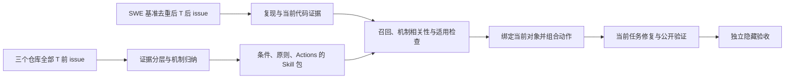

**固定时间点的全量历史学习与自适应 Skill 指导：SWE 实验方案 v2**

日期：2026-10-03。目标项目先用 Pylint，相似项目先用 Pyflakes、Ruff，选择依据见[项目与历史 issue 调研](first-project-for-issue-derived-skills-20261003.md)。方案按本轮要求修改为：**截止日前的全部项目 issue 是学习普查对象；评测候选来自 SWE-bench 及相关基准中的目标项目任务并集；系统用相关性与适用性有证据支持的 Skill 指导当前修复，历史 Workflow 只作参考。**

本方案取代[v1](pylint-swe-skill-effectiveness-experiment-plan-20261003.md)。当前交付是新实验协议、[机器计划](experiment-plans/pylint-temporal-adaptive-skills-v2.json)和[基准来源登记](data/pylint-temporal-skill-plan-v2-20261003/benchmark-source-register.json)，不是已经完成的全量 issue 采集、系统改造或修复实验。14 个种子、三个旧问题族和原 20 个候选不再限制正式学习或评测范围。

**1. 单个时间点约束整个知识系统**

主时间点固定为 **T=2024-01-01 00:00:00 UTC，exclusive**。对 Pylint、Pyflakes、Ruff 都使用同一个 T。

- 历史普查集合 H：三个仓库中 `issue.created_at < T` 的全部 issue，包含已解决、重复、未计划、未解决、讨论和功能请求；PR 是修复证据，需要另采集，不能把 PR 数当 issue 数。
- 知识可用集合 K：H 中在 T 前实际可获得的正文、评论、状态事件、关联修复、提交和测试。较晚创建或编辑的内容不能因为挂在旧 issue 上就进入 K。
- 正式新 issue 集合 Q：SWE 相关基准中属于 Pylint、原始 issue 创建时间不早于 T、输入在公开修复出现前可获得、且通过可执行资格检查的任务。
- 旧 issue 在 T 后才解决属于 backlog：可建立独立分析组，但不混入“新 issue”主结果。其 T 前未解决内容不能被 T 后的答案补全。

判定使用原始 issue 的日期和修复可用日期，不只使用 benchmark created_at 或修复 PR 日期。当前 closed/open 也不是 T 时的状态：需重建 T 前的关闭、重开和合并事件。正文/评论在 T 后编辑时，只有可核实的历史版本可以使用；不能恢复的部分保留 ID 和缺失原因，不将当前文本冒充历史快照。

数据集版本、源码与镜像版本都固定。基础模型是否训练过公开题目通常不可核实；时间点控制的是本系统知识库与运行器，不能声称基础模型完全未见这些题。

**2. 从 SWE 系列基准普查目标项目题目**

先查询所有已登记的 SWE 基准版本，按真实 repository 字段及核实的仓库重命名筛选 Pylint，不能按文件名猜项目。当前冻结调查中已确认：

| 基准/分支 | Pylint 任务身份数，时间筛选前 | 处理方式 |
| --- | --- | --- |
| SWE-bench Full/test | 57 | 纳入登记与时间分类 |
| SWE-bench Lite/test | 6 | 纳入别名与协议登记，检查重复 |
| SWE-bench Verified/test | 10 | 纳入登记，保持独立基准名称 |
| SWE-bench Live/full | 62 | 纳入登记与时间分类 |
| SWE-bench Live/test | 38 | 纳入登记与协议映射 |
| SWE-bench Live/lite | 5 | 纳入登记与重复审核 |
| SWE-bench Live/verified | 29 | 纳入登记，不能作为唯一候选来源 |
| Multi-SWE-bench 的 Python 附加文件 | 10 | 标为附加材料；核实环境/协议后使用，不能冒充正式七语言主集 |

这些数字来自[冻结项目普查](data/swebench-projects-20261003/benchmark-project-census.json)，**不是可相加的独立题数或 T 后合格题数**。Multi-SWE-bench Python 附加文件与 SWE-bench Verified 的全体任务身份集合 hash 相同，至少不能据此增加独立样本量；具体 base/环境差异仍要核验。

同一冻结调查中的 SWE-bench Pro、Multilingual、Multimodal、Live-MultiLang 和 SWE-rebench leaderboard 未登记到 Pylint。保留查询结果，不为凑基准数量虚构项目成员；之后新增版本应作为新登记批次。

对每条记录保存 dataset_id/revision/config/split、原始 instance_id、canonical repository、原始 issue ID/URL、修复 PR ID、base_commit、问题输入的时间来源和 evaluator 标识。读取候选阶段只投影身份、日期和环境元数据，修复 patch/test_patch 由隔离评测侧管理。

按原始 issue/独立 bug cluster 去重，保留它在各基准中的全部别名。同一 issue 有不同 base 或环境时保留变体关系，但不视为独立 issue。代表变体按预定规则选择：正式 Verified 类协议优先，其次正式 test，再 full/lite；附加或重打包材料单独标记。环境和 oracle 是否合格在任何 solver 结果之前判定，不以“哪一版更容易通过”选择代表。

分类结果为：T 前已解决的历史来源、T 前未解决的 backlog、T 后新 issue、已读取 gold 的开发题、重复变体、无法核实输入/环境的未合格记录。处于 T 前的经典 SWE-bench 题目可以成为历史学习来源，不能拿已经包含其答案的库来做新 issue 盲评。

如果要在较早的经典 SWE-bench 题目上做正式新 issue 评测，另立更早的 T，重新从那个 T 前重建完整库。不同时间窗口各自报告，不把 2024 年知识库直接套到 2022 年任务，也不因观察到修复表现再改变 T。

**3. “所有 issue”进入学习流程，不等于每题强行生成一个 Skill**

正式历史采集使用仓库 issues API 的完整分页，按 created_at 的稳定顺序和 cursor 遍历，不使用关键词/top-N 搜索作为总体，也不能受搜索 API 的 1,000 条上限截断。已有 211 个关键词样本和 14 个种子只用于联调。

记录分页游标、首尾日期、仓库节点身份、重复 ID、可恢复失败和覆盖缺口；按时间切片核对数量。所有正文/评论/patch 在输出和保存前脱敏，不读取认证配置或在日志中保存凭据值。

| 历史类别 | 学习贡献 | 准入要求 |
| --- | --- | --- |
| 有实施修复和可验证行为的 issue | 可迁移原则、动作、版本边界和验证方法 | T 前修复证据；因果与回归复验；明确限制 |
| 重复、相互引用的 issue | 别名、不同触发写法、共同症状 | 独立记录来源；同一 bug 不伪装成多个独立支持 |
| 未计划、预期行为、讨论 | 不适用情形、配置/版本前提、误用反例 | 有 T 前的明确结论支持；不能仅凭关闭状态推断原因 |
| 未解决或证据不够的 issue | 诊断假设、覆盖缺口、待核实问题 | 明确未验证；不能编造成功修复或可执行正向动作 |
| 无法恢复历史文本、缺少环境等 | 审计与缺失分析 | 保留缺失原因，不静默替换或丢弃总体记录 |

所有 issue 均有 disposition，统计恒等式覆盖全部普查对象。可以先确定性归一化和聚类，再按簇综合多个证据提取，降低重复模型调用；抽取单元允许一个 issue 多包或多个 issue 支持一个包。未解决问题默认不进入可执行修复 Skill 库，可用于诊断假设或适用性负例，但必须保留其证据级别。

问题族由全历史数据归纳，**不再预设只学习名称绑定、注解、TYPE_CHECKING**。推断、崩溃、配置、路径、命名规则、语法支持、Pyreverse 等符合证据门槛的历史问题均可纳入。评测题也不能因不属于旧三个族而排除；缺少相关 Skill 时保留该题并回退正常 Agent。

**4. 新 Skill 内容契约：条件、原则和动作**

Skill 仍必须是有真实 SKILL.md 的完整文件包。稳定知识与历史执行序列分开：

- SKILL.md：触发信号、可检验的机制、语义责任边界、不变量、适用/不适用条件、可选动作、验证要求及停止条件。
- actions：操作语义、前置条件、所需输入、保证的不变量、输出、直接/回归验证和禁用条件。
- workflow reference：记录历史问题如何解决，标记为 historical example；文件名、接口、版本和历史顺序属于证据。
- provenance/evidence：T 前独立来源、具体修复和实际测试状态。
- activation/applicability/functional eval：来源于历史输入和有语义依据的变形，不引用最终评测答案。

历史 Workflow 可以说明动作之间为何有依赖，不能自行决定新任务的执行顺序。若动作 B 的前置条件依赖 A 的输出，新任务仍应保留这种语义依赖；不存在依赖时允许重排、跳过、替换或与其他 Skill 的动作组合。

原生文件提取、引用闭环和包 hash 继续是 mandatory output。未经验证的 hypothesis、结构审计 Pattern、deferred/rejected 包不能作为完成修复的指令。Pattern 支持需要不同项目的独立修复与同一语义机制，不能把相同词语或复制测试当归纳证据。

**5. 检索从“相似文本”升级为“当前代码支持的相关性”**

系统分两轮理解任务：先根据公开 issue、环境和实际症状产生初始 query；复现并检查 base 代码后，用诊断、调用/分析入口、数据与控制状态更新 query。输入不包含隐藏 test_patch、gold 文件名或由 gold 得来的问题族标签。

BM25/dense/HNSW 负责召回，图扩展提供相关动作和不变量；它们的分数不直接授权修改。候选需要通过以下检查：

| 检查 | 当前任务应提供的依据 |
| --- | --- |
| 症状与机制 | MRE、诊断、异常栈、节点角色或状态转换支持同一机制，而非仅共享关键词 |
| 责任边界 | 当前代码中谁拥有该状态/判断，与 Skill 的语义 owner 是否对应 |
| 前置条件 | 当前类型、scope、配置、API 和版本是否满足；未知项需先 probe |
| 反例 | Skill 的不适用条件是否命中；哪些正常行为必须保留 |
| 动作可落实性 | 所需对象/接口在当前代码中存在，或已明确给出可验证的适配 |
| 验证 | 当前 issue 与现有代码能提供何种 oracle 和邻近对照 |

“高相关”需要这些证据和可执行前提，不是 judge 说 confidence=0.9。缺少机制依据时只允许诊断 probe；没有合格 Skill 时不给无关指导。失效或矛盾的 Skill 退出当前计划，最多三轮检索/复查，消耗计入共同预算。

来源、包状态与完整性是硬门槛，在 graph expansion 和所有 resource hydration 时都执行。相似项目的实现语言可以不同；例如从 Ruff 迁移 Python 语义判断，并不授权在 Pylint 中使用 Ruff 的 Rust 类型或旧文件路径。

父 Skill 被批准不代表所有相邻 Atomic 都自动适用。图邻居只是动作候选，每个实际拟使用的动作仍需检查当前前提和 binding。

**6. 动作适配器生成当前任务的计划，不回放历史 Workflow**

适配器输出本次 task plan，作为运行记录保存，不把它自动登记为新 Skill。每个拟执行动作包含：

| 字段 | 要求 |
| --- | --- |
| selected_skill / action / package hash | 可解析到真正的冻结包；允许多个 Skill 支持同一任务 |
| current evidence | 当前 base 的文件/符号/片段、复现或实际观察；不能拿历史文件冒充当前证据 |
| relevance basis | 同一机制与责任边界的解释，以及未满足/待确认条件 |
| current binding | 操作当前哪个对象、入口或状态，使用哪个当前接口 |
| shared invariant | 从历史提取并要在当前任务保持的行为原则 |
| adaptation | 哪些历史动作保留、重排、跳过或替换，理由是什么 |
| proposed operation | 具体操作与前置条件，不能只有 analyze/implement/validate |
| validation / stop | 当前验证、邻近正常行为、停止和回退条件 |

Agent 根据实际结果继续修正 task plan；某条历史操作不适用时不必完成它。只有当当前条件和语义依赖确实一致时才可以保留相同顺序。不能以“文本顺序不同”评价适配成功，也不为制造新颖性强迫改写正确方案。

适配可以集成在同一个修复 Agent 的正常推理与工具循环中，不要求另开 Agent，也不把这些记录变成另一套必须照做的固定阶段。Skill 的作用是提供原则、可用动作与验证边界；具体解法由当前问题和代码决定。

历史修复代码默认留在证据侧；需要读取时通过受限资源入口并带来源/版本说明。检索视图优先提供原则、边界和动作，历史 Workflow 明确标为示例。既不能偷偷用临时 JSON 代替真正 Skill，也不能把全套旧 Workflow 拼进 prompt 后就宣称完成了自适应。

一个具体例子：TYPE_CHECKING 内导入的 unused-variable 误报与块外运行时使用的 used-before-assignment 漏报可能共享关键词。系统应先核实当前诊断、使用位置和分析入口，再决定消除误报或保留诊断；不能把“历史上增加过跳过条件”直接应用到所有 TYPE_CHECKING 任务。

**7. 需要实施的系统改造**

| 层次 | 现有基础 | 新要求与验收 |
| --- | --- | --- |
| 历史采集 | 关键词研究脚本和 issue/PR bundle | 全分页普查、T 时状态重建、编辑/缺失隔离、全部 issue disposition |
| 提取元契约 | [直接文件提取](../experiments/run_codex_issue_episode_extraction.py)、[发布与投影](../src/arex_skill_graph/direct_skill_extraction.py) | 多 episode 归纳；稳定原则/动作与历史 Workflow 分开；引用 T 前证据 |
| 检索 | [SkillRetriever](../src/arex_skill_graph/retrieval.py) | 用当前观察更新 query，来源过滤，语义 owner/机制/前提/反例检查，空检索回退 |
| 当前任务适配 | 现有 package hydration 与 applicability 判断 | 新 action selection/binding/validation 记录，支持跨 Skill 组合与跳过，不按历史 steps 回放 |
| 指导渲染 | [现有运行器](../experiments/run_cross_project_holdout_agent_eval.py)的 _render_hit/_build_guidance | 指导角色分离、受限 reference 读取、当前 evidence 与 adaptation 进入 prompt |
| 基准适配 | 现有案例准备/资格检查 | 多基准 registry、issue 去重、T 分类、各自官方 harness 和独立隐藏 evaluator |
| 结果与反馈 | 配对评分和独立 registry | 记录实际动作依据、退回与损害；主实验冻结，不能把评测答案写回知识库 |

代码核查发现：当前 _build_guidance 有向 applicability judge 提供 visible_test_patch 的路径。这是旧可见测试实验的设计，在新 SWE 隐藏验收协议中必须移除；judge 只能读取公开 issue、base 和 Agent 自己产生的观察。当前 _render_hit 直接 hydrate 包，尚不足以证明动作适配已经实现。

实现时至少检查：T 后证据被拒绝；全部分页可续传且无截断；重复基准不增加独立题数；不存在的旧路径/接口不能成为当前 binding；相关症状但反例命中时拒绝；无 Skill 能正常回退；两个包的可用动作能够组合；历史顺序只有语义依赖才继承；隐藏测试不进入检索/judge/planner；所有输入与成本可审计。

**8. 评测集合与运行规模重新确定**

先完成所有登记基准的 Pylint 元数据并集、原始 issue 映射和 T 分类，再确定最终 N。取消原来“仅 Live verified 的 20 题”与按三个族、Pyreverse、新语法等预先排除的规则；保留已经读取 gold 的开发暴露记录。

每个候选在隔离评测侧验证 base-fail/gold-pass、P2P、收集数量、环境锁定及邻近对照。设计者被迫读取修复的题转开发，不能继续标盲评。无法运行、oracle 不清或输入不可恢复的任务记录未合格原因。不得用任何组的修复率决定是否保留任务。

资源有限时，从合格并集按时间和公开问题类型进行预先固定的分层随机 pilot，最多 20 题；不按 Skill 是否能覆盖选题。Pilot 的范围单列，后续独立确认使用全体合格集或另一个预先冻结样本。正式 N 未知，不能声称已增加了多少合格题。

**9. 主对照与“不能照搬”的机制对照**

| 组 | 历史与指导方式 | 比较目的 |
| --- | --- | --- |
| B0 | 无额外历史指导 | 相同 Agent 基线 |
| B1 | 从同一时间与证据门槛的历史并集中检索原始证据；使用当前任务证据做相关性检查 | 历史 RAG 基线 |
| B2 | 从全部 Pylint 历史学习的 Skill＋当前动作适配 | 自身项目经验 |
| B3 | 从全部 Pyflakes/Ruff 历史学习的 Skill＋当前动作适配 | 跨项目经验 |
| B4 | 自身＋相似历史 Skill＋强相关检查＋当前动作适配 | 完整新系统 |
| B5，机制对照 | 与配对的 B4-matched 共享修复前证据、选定包、来源和前提硬门槛，直接提供历史有序 Workflow 指导，保留 Agent 正常推理能力 | 当前动作适配相对历史 Workflow 指导的贡献 |

B5 不强迫复制 Rust patch 或禁止 Agent 思考。机制实验从同一个无历史指导的复现/当前代码观察前缀分支：先冻结公开证据、相关性判断、选定包及其 hash，再分别运行 B4-matched 的显式动作适配和 B5 的历史 Workflow 指导。两支保留相同前提、反例、验证条件和资源权限，前缀成本计入两支共同上限。分支后不交换观察、plan、patch 或结果，也不让 B5 使用 B4 后续发现；两支只能重查已冻结包的当前适用性，不引入不同的新包。主 B4 可以按规定再次检索，故机制比较明确记为 B4-matched−B5，不假称后续检索不同的两条轨迹仍使用了完全相同的 Skill。

另做相同证据 ID 的 raw vs Skill 对照，两边使用相同当前任务证据与适配条件；无图扩展；无语义适用 judge（保留硬门槛）；自身来源数量匹配；逐 donor 移除。B4−B1 是系统相对 RAG 的增量，不能单凭它归因于表示。B4−B2 也不自动证明相似来源优于同数量额外自身历史。

**10. 预算与重复公平**

先在已暴露的开发题校准模型、prompt、工具和预算，然后冻结全部包/索引及运行配置。预算包括复现、检索、judge、适配规划、后续重查和最终修复。不同组的执行器、本地状态、供应方缓存策略与资源上限相同。

Solver 只看到原始公开问题、对应 base、固定依赖和本组获准的指导。运行环境不得包含未来 Git 对象、目标修复/隐藏测试、其他组轨迹或额外自动加载的全局 Skill。任务工具默认禁止外网，模型请求走受控入口；依赖与镜像在运行前按锁定版本准备，不能运行中搜索目标答案、benchmark 镜像或 T 后 donor issue/PR。记录并验证这些输入边界，不能仅靠 prompt 声称隔离。

可沿用起始 cap：每次累计 300,000 LLM input+output token、历史指导累计 6,000 token、最多两个指导单元、60 次累计模型调用（含检索、judge、planner）、120 次工具调用、30 分钟。不能给 B4 增加不计量的 planner。先验数字可在开发阶段统一校准，不能根据正式题的表现修改。

每个 task×replicate 随机排列组别，R=3 次独立尝试；每次一个最终 patch，报告平均 pass@1，不选三次中的最好结果。N=20 时主五组为 300 条轨迹；若另在同样 20 题执行 B4-matched/B5 两支机制实验，再增加 120 条，合计 420 条。机制实验也可预先指定较小的独立样本；这些只是资源算例，不是已冻结的 N 或执行次数。

**11. 成功、相关性与适配的指标**

修复主指标仍为 ValidatedResolved@1：官方 benchmark 验收、冻结邻近行为与回归检查通过，且无泄漏/测试篡改。各来源的 BenchmarkResolved@1 单列，不能把跨基准自建去重集称为某个官方 leaderboard 成绩。验收在 Agent 结束后独立执行，隐藏结果不能返给 Agent 追加修复。

同时报告以下层次：

| 层次 | 指标 |
| --- | --- |
| 历史覆盖 | 全部 issue 数、T 时可恢复比例、各 disposition、合格修复/负例、未验证来源、实际包数 |
| 检索 | 正确相关候选覆盖、强相关批准/错误批准/正确拒绝、无匹配回退；人工/独立标签依据公开 issue 与 base |
| 适配 | 有当前证据的 action binding 比例、错误旧接口/路径、跳过/重排/替换原因、组合后前提和不变量是否保持 |
| 真实效果 | 配对增加/损害的修复、邻近诊断保留、不适用题结果、逐题差异 |
| 成本 | 全历史采集/学习/建索引的离线成本，在线相关判断＋适配＋修复成本，失败与重跑成本 |

Judge 自报置信度、Action 引用数、历史 Workflow 顺序变化和文本相似度都不能单独证明指导有效。分析所有配对分歧，盲化审阅 patch 与轨迹中的实际操作；保留正确沿用相同顺序的情况，不把“越不同越好”设为目标。

统计单位是独立 issue/bug cluster。主比较 B4−B0/B1/B2，另预注册 B4-matched−B5 的适配比较；若 B5 确认性运行，四项比较一起控制多重检验。报告任务级配对差、95% 区间、全体和事先定义的分层结果。重复轨迹不能扩大独立样本数，小 pilot 只给方向和机制证据。

超时、额度耗尽和正常工具失败计失败。短暂基础设施问题最多一次完整匹配 block 重跑，原成本保留；泄漏使受影响协议无效，不能只删不利结果。正式结果出现后的库、时间点或预算改变建立新版本、新 cohort。

**12. 按这个顺序实施**

1. **S1 基准任务总登记**：所有 SWE 相关来源中 Pylint 的身份投影、原始 issue 映射、去重、时间分类和暴露记录；输出候选并集，N 暂不预设。
2. **S2 历史总体建立**：三个仓库全部 T 前 issue/事件/修复普查，恢复 T 时快照、逐条 disposition，审计覆盖与缺失。
3. **S3 全历史 Skill 学习**：聚类、证据复验、原则/动作归纳、真实包和训练期 eval；构建自身、相似、混合三套只读 catalog。
4. **S4 强相关与适配层改造**：当前证据驱动 query、机制与前提检查、当前 action binding、组合/跳过、停止回退和指导角色渲染；隐藏测试隔离。
5. **S5 开发与正式冻结**：在开发题做 smoke，验证 controller 和 oracle；冻结模型/预算/包/环境/合格题/调度/统计代码。
6. **S6 基准修复实验**：先预定 pilot，再按计划独立确认；所有组相同资源，主库不在线更新。
7. **S7 机制与扩展**：Workflow 指导对照、来源/表示/图消融、第二目标项目或独立更早时间窗；各自重建相应 T 前库。

下一步应先完成 S1/S2 的总体和时间记录，使“来自 SWE 基准”和“来自全部历史”可审计，再进行包学习与适配器实现。当前没有启动全量模型抽取或正式 solver 运行；原始研究种子继续作为联调材料，不能再冒充完整历史学习集。
